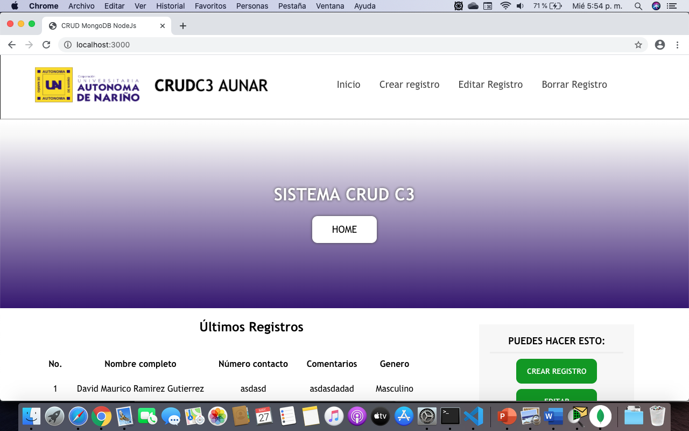
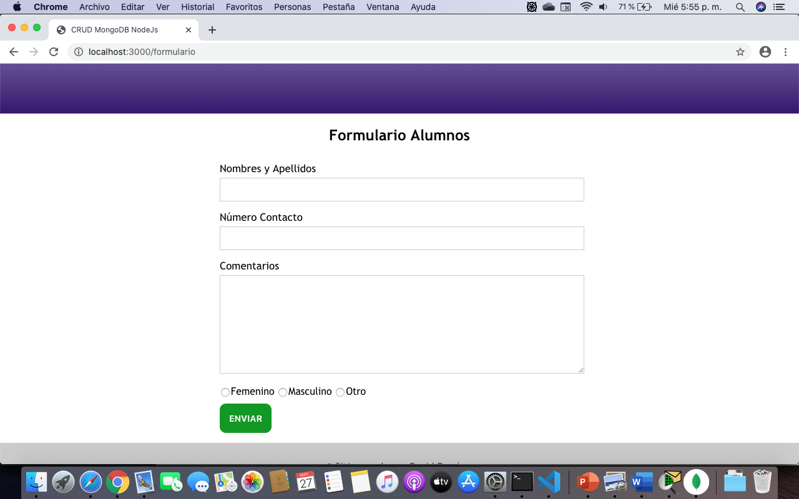
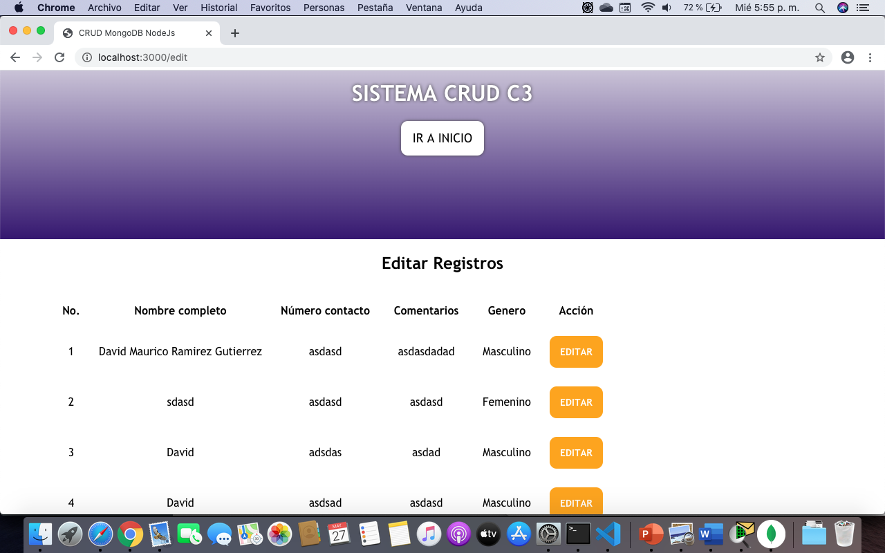
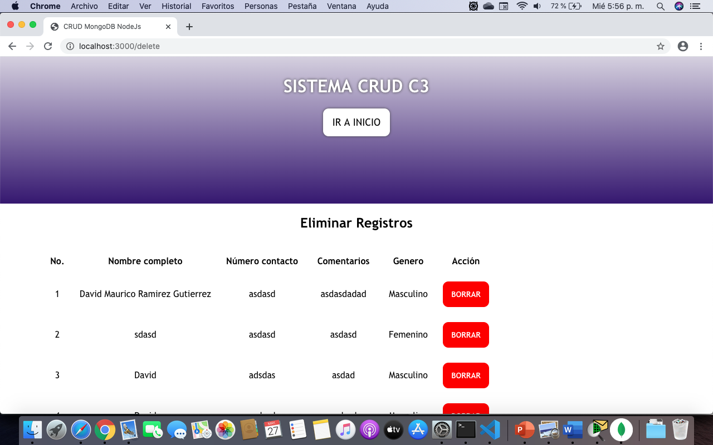

# CRUD MongoDB Cloud NodeJs / Express

Sistema CRUD educacional desarrollado en Node.Js y CSS puro para entender el funcionamiento las operaciones básicas (Create Read Update Delete). El sistema está implementado con el paquete de dependencias Express y está implementado con el sistema DBaaS Cloud Atlas de Mongo DB.

Requisitos para descargar el proyecto (clonar) y usar:
- Tener instalado git (www.git-scm.com)
- Configurar una cuenta de MongoDB Atlas (https://www.mongodb.com/cloud/atlas) y dar de alta un Shared Cluster (Puede ser la Free). De esta manera puedes obtener un connection string para reemplazar el del código fuente de este repositorio. (línea 33 del /src/app.js)

Pasos para clonar:
1. Entrar a algún directorio de tu Sistema Operativo en una ventana terminal (CMD en Windows)
2. ejecutar el comando: git clone https://github.com/davidmrg/CRUDNodeJsExpress.git

Pasos para ejecutar:
1. Ingresar al directorio del proyecto, ingresar al sub-directorio /src.
2. Ejecutar comando: node app.js (Si usas nodemon: nodemon app.js)
3. Abrir en un navegador: localhost:3000

Pantalla Index:

Pantalla Formulario de ingreso de datos:

Pantalla Edición de datos:

Pantalla Borrado de datos:

